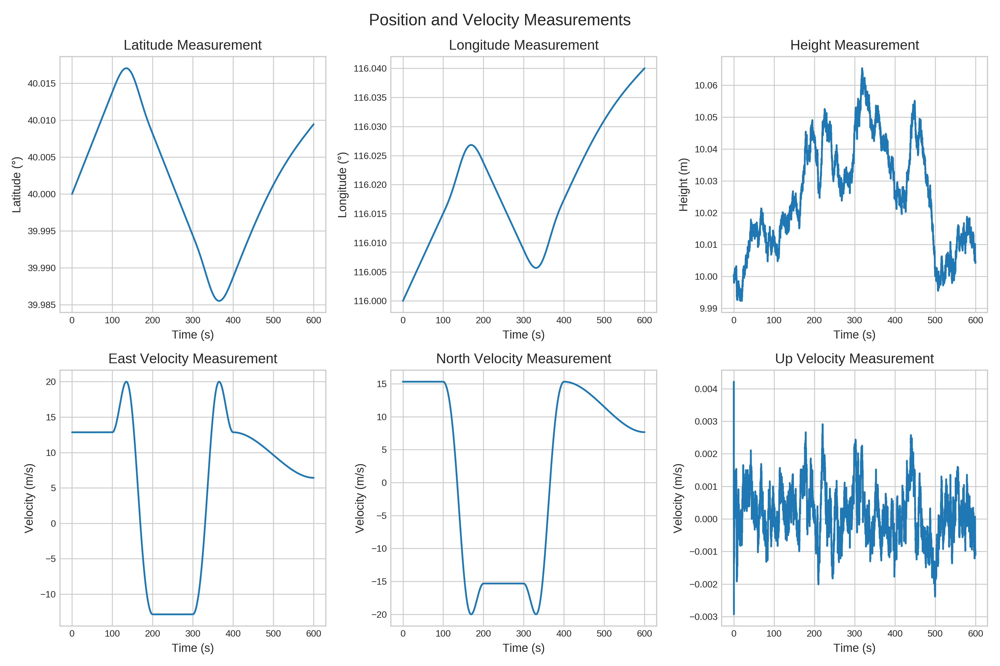
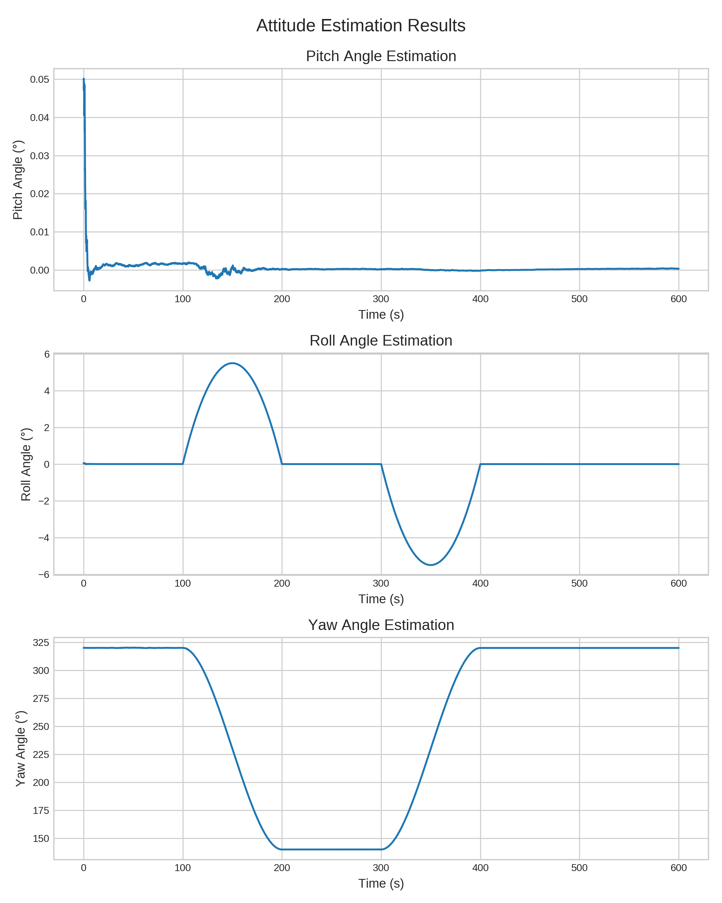
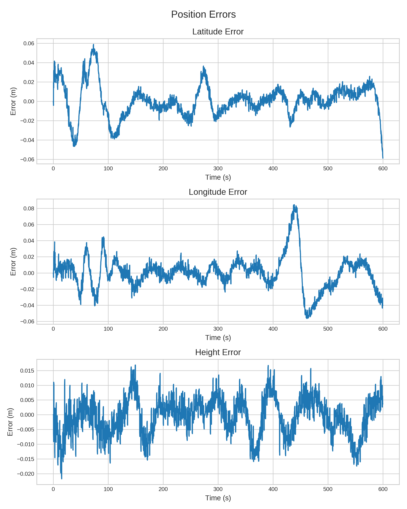
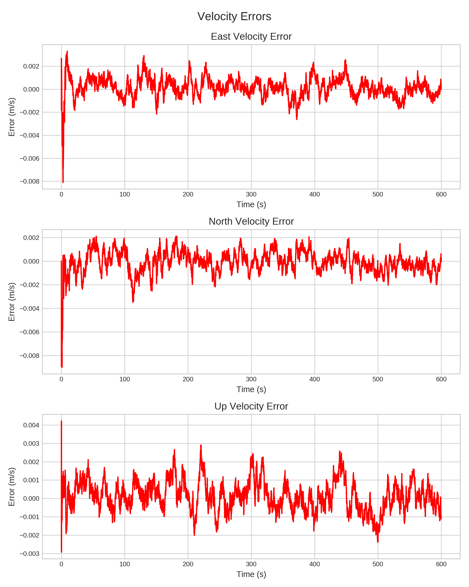
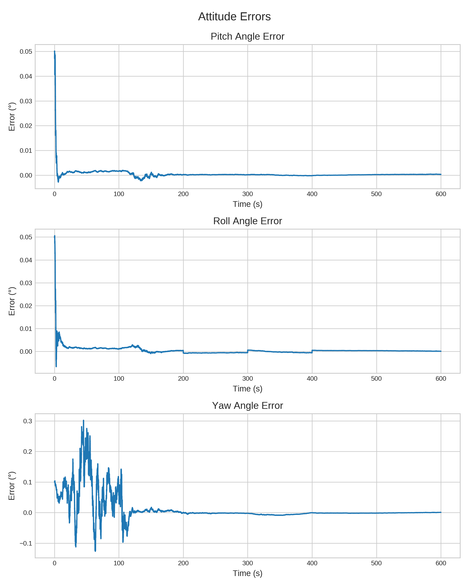
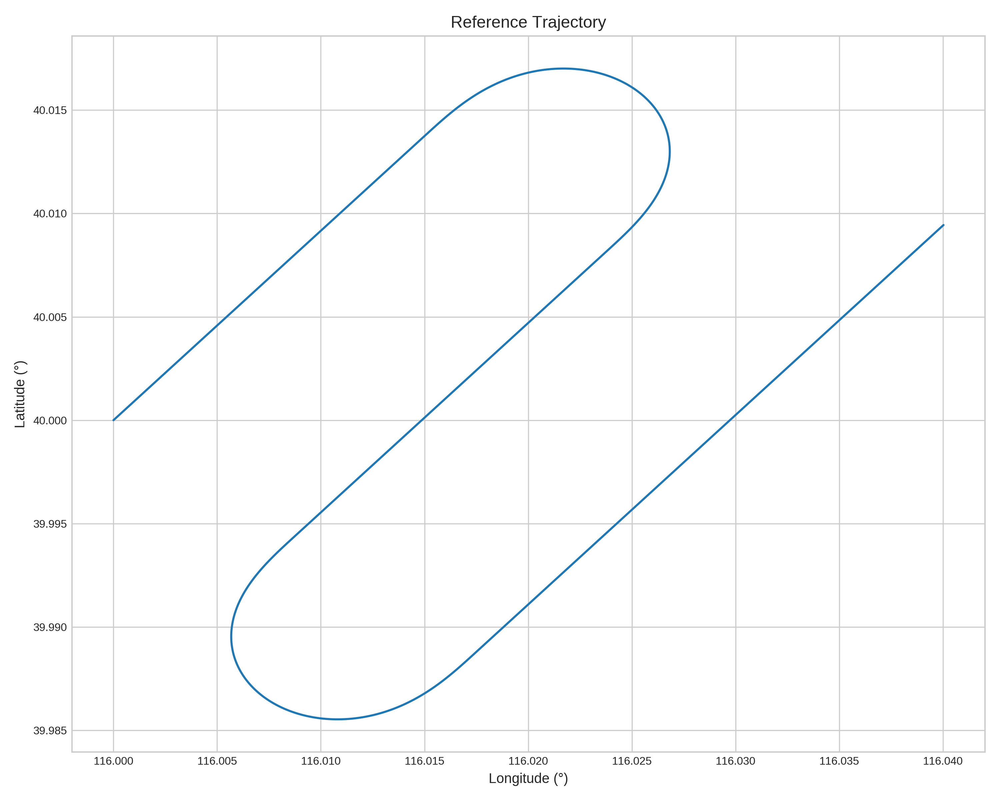

# Navigation Filter Library

A modular C++17 framework for Inertial Navigation System (INS) + GNSS loosely‑coupled integration, featuring a 15‑state error‑state Kalman filter, deterministic simulation data, and visualisation tools.

---

## Features

| Category            | Highlights                                                                                                 |
| ------------------- | ---------------------------------------------------------------------------------------------------------- |
| **Algorithms**      | Strapdown mechanisation · 15‑state error‑state Kalman filter · Somigliana gravity with altitude correction |
| **Modularity**      | Individual libraries: `MathUtils`, `DataLoader`, `SystemInitializer`, `NavigationCore`, `SaveResults`      |
| **Reproducibility** | Synthetic dataset with fixed‑seed sensor‑noise injection                                                   |
| **Tooling**         | CMake ≥ 3.15 build · Eigen‑only dependency · Python visualiser (`scripts/nav_visualizer.py`)                 |

---

## Simulation Data Precision

> The synthetic dataset emulates a navigation‑grade IMU + GPS. Key 1σ error characteristics (from **data/README.md**) are summarised below. These values are hard‑coded in the C++ noise models and reproduced in every run.

* **GPS horizontal position**: ±3 m
* **GPS vertical position**: ±3 m
* **GPS velocity**: ±0.01 m/s per axis
* **Gyroscope bias / white‑noise**: 0.01 deg/h each
* **Accelerometer bias / white‑noise**: 50 µg each

All random seeds are fixed, guaranteeing run‑to‑run repeatability.

---

## Repository Layout

```text
.
├── CMakeLists.txt          # Top‑level build script
├── include/                # Public headers (*.hpp)
├── src/                    # Library & app sources (*.cpp)
├── data/                   # Synthetic sensor + ground‑truth dataset
├── output/                 # Generated results (created at runtime)
├── scripts/
│   └── nav_visualizer.py   # Result visualisation utility
├── tests/                  # Legacy Google Test suites (deprecated)
└── README.md               # You are here
```

---

## Quick Start

### 1 · Prerequisites

| Software      | Version | Notes                              |
| ------------- | ------- | ---------------------------------- |
| CMake         | ≥ 3.15  | Build system generator             |
| C++ Compiler  | C++17   | GCC ≥ 9 / Clang ≥ 11 / MSVC ≥ 19.3 |
| Eigen         | ≥ 3.3   | Header‑only linear algebra         |
| Python (opt.) | ≥ 3.8   | For visualisation only             |

Install Eigen via your package manager, e.g.:

```bash
sudo apt install libeigen3-dev
```

### 2 · Build

```bash
# Clone & build
mkdir build && cd build
cmake ..
make
```

</details>

### 3 · Run Simulation

```bash
cd build/bin
./main_app            # 600 s INS/GPS simulation
```

Outputs:

* `output/KF_navoutQ.dat` – navigation solution
* Console RMS error summary

### 4 · Generate & Save Visualisations (optional)

```bash
python3 scripts/nav_visualizer.py --save
```

Seven artefacts are written to **output/** (six PNG figures + `performance_statistics.txt`).

---

## Example Visualisations

Below are the figures produced by `nav_visualizer.py`.

### 1. Position & Velocity Measurements

<p align="center"></p>

### 2. Attitude Estimation Results

<p align="center"></p>

### 3. Position Errors

<p align="center"></p>

### 4. Velocity Errors

<p align="center"></p>

### 5. Attitude Errors

<p align="center"></p>

### 6. Reference Trajectory

<p align="center"></p>

### 📊 Performance Statistics

| Metric                  | RMS Error     |
|-------------------------|---------------|
| Latitude Error          | 0.036382 m    |
| Longitude Error         | 0.049501 m    |
| Height Error            | 0.033429 m    |
| Yaw Angle Error         | 0.011062 °    |
| Pitch Angle Error       | 0.000453 °    |
| Roll Angle Error        | 0.000631 °    |


---

## Algorithm Overview

1. **Strapdown Mechanisation** – attitude, velocity & position propagation (`NavigationCore.cpp`).
2. **Kalman Filter** – 15 states (attitude, velocity, position, gyro & accel bias) updated at 20 Hz.
3. **Sensor Models** – bias + white noise added to ideal IMU (`DataLoader::addIMUNoise`).
4. **Gravity Model** – Somigliana formula with altitude term (`NavigationCore::calculateGravity`).

---

## Dataset

Synthetic navigation data live in **data/** and are detailed in `data/README.md`.

---

## Tests

`tests/` holds historical Google Test suites maintained for reference only; they may not compile against the current API.

---

## Roadmap

* ✅ Base INS/GNSS KF (v0.1)
* 🔜 Extended/Unscented Kalman Filter/...
* 🔜 Multi‑sensor fusion (magnetometer, ...)
* 🔜 Real‑time ROS node

Contributions & feature requests are welcome!

---

## Contributing

1. Fork → feature‑branch → PR.
2. Follow the [Contributor Covenant](https://www.contributor-covenant.org/).
3. For large changes, open an issue first.

---

## License

Released under the MIT License – see `LICENSE` for full text.

---

## Citation

```bibtex
@software{peanut-nav_navigation_filter_2025,
  author  = {Peanut‑nav},
  title   = {Navigation Filter Library},
  year    = {2025},
  version = {0.1.0},
  url     = {https://github.com/peanut-nav/navigation-filter-lib}
}
```

---

## Authors

* **peanut‑nav** – initial architect / maintainer

---

> *Enjoy navigating!*
