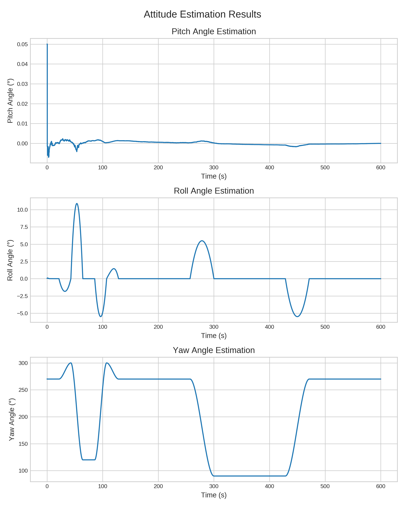
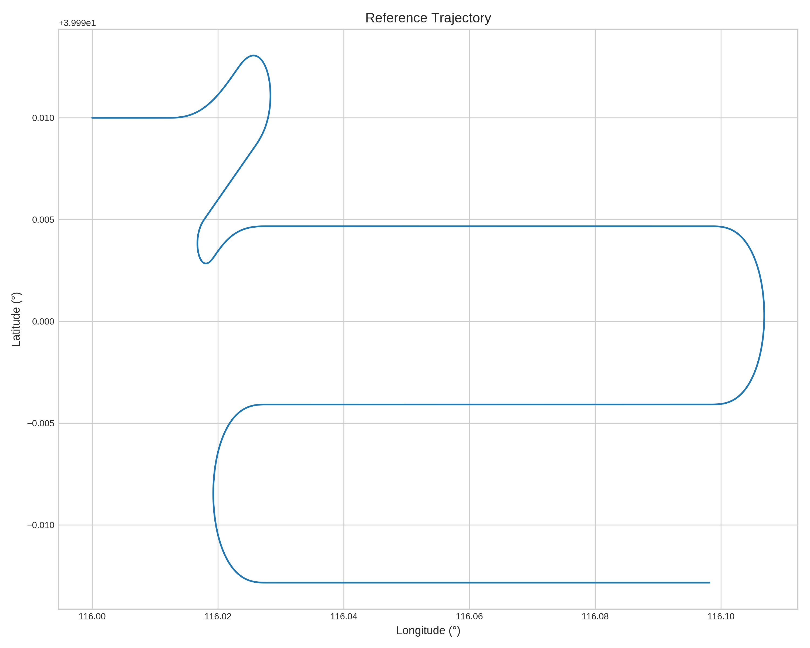

# Navigation Filter Library

*A modular C++ framework for strap-down INS + GNSS, implementing **error-state** KF / EKF / UKF (ESKF / ESUKF) with optional RTS smoothing.*

---

## ✨ Highlights

| Category            | Details                                                                                                                         |
| ------------------- | ------------------------------------------------------------------------------------------------------------------------------- |
| **Algorithms**      | Strap‑down mechanisation · 15-state **error-state** KF / EKF / UKF (ESKF/ESUKF) · RTS smoother · Somigliana gravity model                         |
| **Modularity**      | Header‑only math helpers · pluggable **Initializers** · interchangeable KF/EKF/UKF **Navigation cores** · optional RTS **Smoother** |
| **Tooling**         | CMake ≥ 3.15 · Single dependency: Eigen3 · Python 3 visualiser (`scripts/nav_visualizer.py`)                                    |
| **Reproducibility** | Synthetic IMU + GPS dataset with fixed seeds ✔️                                                                                 |

---

## 📂 Repository Layout

```text
.
├── CMakeLists.txt         # Top‑level build script
├── include/               # Public C++ headers
│   ├── core/              # NavigationCore + RTS smoother APIs
│   ├── initializers/      # System initialisation helpers (KF EKF UKF)
│   ├── params/            # Strong‑typed parameter structs
│   └── MathUtils.hpp      # Common math utilities
├── src/                   # Library & application sources
│   ├── core/              # KF / EKF / UKF / RTS implementations
│   ├── initializers/      # KF  EKF UKF specific initialisers
│   └── main_{kf,ekf}.cpp  # Demo executables
├── data/                  # Deterministic sensor & ground‑truth data
├── scripts/               # Plotting & analysis helpers
│   └── nav_visualizer.py
├── output/                # Auto‑generated results (created at run‑time)
└── README.md              # You are here
```

---

## 🚀 Quick Start

### 1 · Prerequisites

| Software                | Version | Install hint                       |
| ----------------------- | ------- | ---------------------------------- |
| **CMake**               | ≥ 3.15  | `sudo apt install cmake`           |
| **C++ Compiler**        | C++17   | GCC ≥ 9
| **Eigen**               | ≥ 3.3   | `sudo apt install libeigen3-dev`   |
| **Python** *(optional)* | ≥ 3.8   | For visualisation only             |

### 2 · Build

```bash
# Configure & build (out‑of‑source)
mkdir -p build && cd build
cmake ..
make
```

### 3 · Run Simulations

Two demo executables are produced in **build/bin/**:

| Executable                | Description                                    |
| ------------------------- | ---------------------------------------------- |
| `IntegratedNavigationKF`  | 15-state **error-state** linear Kalman filter + RTS         |
| `IntegratedNavigationEKF` | 15-state **error-state** Extended Kalman filter + RTS |
| `IntegratedNavigationUKF` | 15-state **error-state** Unscented Kalman filter + RTS |

Example run (EKF + RTS):

```bash
cd build/bin
./IntegratedNavigationEKF
```

Outputs are written to **output/**:

* `EKF_navoutQ.dat` / `KF_navoutQ.dat` – raw navigation solution
* `smoothed_EKF_navoutQ.dat` / `smoothed_KF_navoutQ.dat` – RTS‑smoothed solution
* `performance_statistics.txt` – RMS error summary

### 4 · Visualise Results *(optional)*

```bash
python3 scripts/nav_visualizer.py --save  # creates PNG figures in output/
```

Generated artefacts include position/velocity time‑series, attitude plots, error curves and the reference trajectory.

Seven artefacts are written to **output/** (six PNG figures + `performance_statistics.txt`).

---

## 🧑‍🔬 Algorithm Overview

1. **Strap‑down Mechanisation** – propagates attitude, velocity & position in the navigation frame.
2. **Kalman Filtering**

   * **KF**: linear error‑state model.
   * **EKF**: non‑linear propagation using RK4, discretised Jacobians.
3. **RTS Smoothing** – backward pass refines the whole trajectory using future information.
4. **Sensor Models** – deterministic IMU noise injection replicates navigation‑grade sensors.
5. **Gravity** – Somigliana model with altitude correction.

---

## 📊 Example Visualisations

Below figures are created by `nav_visualizer.py` from the EKF run:

|                                                              |                                                          |
| :----------------------------------------------------------: | :------------------------------------------------------: |
|  |               |
|                |            |
|                |  |

For full numerical metrics see **output/performance\_statistics.txt**.

### 📊 Performance Statistics (EKF + RTS smoother)

| Metric                  | RMS Error     |
|-------------------------|---------------|
| Latitude Error          | 0.012959 m    |
| Longitude Error         | 0.019882 m    |
| Height Error            | 0.006577 m    |
| Yaw Angle Error         | 0.001972 °    |
| Pitch Angle Error       | 0.000263 °    |
| Roll Angle Error        | 0.000568 °    |

---

## 📁 Dataset

Synthetic sensor and ground‑truth files reside in **data/**. Key 1σ characteristics (hard‑coded):

* **GPS**: ±3 m horizontal & vertical, ±0.01 m/s velocity
* **Gyro bias**: 0.01 °/h per axis
* **Accel bias**: 50 µg per axis

All random seeds are fixed → every run is bit‑for‑bit repeatable.

---

## 🛠️ Tests

Legacy Google Test suites live in **tests\_old/**. They are **deprecated** but kept for reference.

---

## 🗺️ Roadmap

* ✅ v0.4 – error-state KF/EKF/UKF core & RTS smoother
* 🔜 Multi‑sensor fusion (magnetometer, …)
* 🔜 Real‑time ROS node

PRs & feature requests welcome!

---

## 🤝 Contributing

1. Fork → feature‑branch → PR.
2. Follow the [Contributor Covenant](https://www.contributor-covenant.org/).
3. For large changes, open an issue first.

---

## ⚖️ License

MIT License – see `LICENSE` for full text.

---

## 📚 Citation

```bibtex
@software{peanut-nav_navigation_filter_2025,
  author  = {Peanut‑nav},
  title   = {Navigation Filter Library},
  year    = {2025},
  version = {0.3.0},
  url     = {https://github.com/peanut-nav/navigation-filter-lib}
}
```

---

## ✏️ Authors

* **peanut‑nav** – architect / maintainer

---

> *Happy navigating!*
